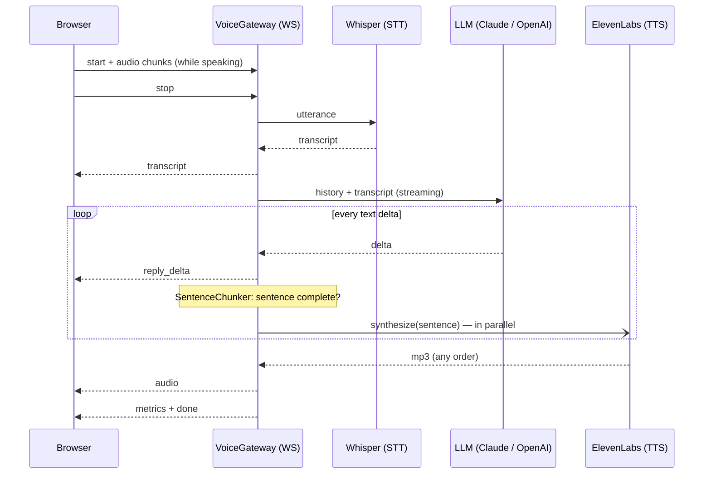

# 🎙️ Realtime Voice AI


A real-time voice assistant you can **talk to in the browser**: speech-to-text → a streaming LLM → text-to-speech, wired together over WebSockets with **NestJS**.

The focus is **latency**. A naive voice pipeline waits for each stage to finish before starting the next one, and the user waits through all of them. This one overlaps the stages, so the assistant starts speaking while the LLM is still writing its answer.

## ✨ Features

- 🗣️ **Push-to-talk in the browser.** Hold the button or the space bar. Audio is uploaded *while* you speak.
- ⚡ **Sentence-level streaming.** Every finished sentence goes to TTS immediately, without waiting for the full reply.
- 🔀 **Parallel TTS, ordered playback.** Sentences are synthesized concurrently and played strictly in order.
- ✋ **Barge-in.** Start talking while the assistant speaks: its reply is cancelled end to end via `AbortSignal`.
- 🧠 **Pluggable LLMs.** **Claude** (default) or **OpenAI**, behind one `LanguageModel` interface.
- 📊 **Built-in latency metrics** for every turn: STT, time to first LLM token, time to first audio, full turn.
- 💬 **Conversation memory** per WebSocket connection, capped to keep long chats fast.
- ✅ **Unit tests, CI and Docker.**

## 🏗️ Architecture



```
src/
├── main.ts                      # Nest bootstrap, WebSocket adapter, static client
├── app.module.ts                # wires providers from config
├── config.ts                    # env validation
├── providers/
│   ├── types.ts                 # SpeechToText / LanguageModel / TextToSpeech interfaces
│   ├── stt/whisper.stt.ts
│   ├── llm/claude.llm.ts        # Anthropic SDK, streaming, refusal fallback
│   ├── llm/openai.llm.ts
│   └── tts/elevenlabs.tts.ts
└── voice/
    ├── voice.gateway.ts         # WebSocket protocol, sessions, barge-in
    ├── voice-pipeline.ts        # one turn: STT → LLM → chunker → TTS
    └── sentence-chunker.ts      # turns text deltas into speakable chunks
public/index.html                # zero-build browser client
```

## ⏱️ Where the latency goes

| Technique | What it saves |
|---|---|
| Upload audio during speech (`MediaRecorder` timeslices) | Upload time after the user stops talking |
| Stream LLM output | Waiting for the full reply before doing anything |
| Sentence chunking → TTS per sentence | Waiting for the full reply before speaking |
| Parallel TTS with ordered delivery | Sentences no longer queue behind each other |
| Low-effort LLM setting + short spoken-style replies | Model thinking time and TTS length |
| `eleven_flash_v2_5` voice model | TTS generation time |

The **First audio** metric in the UI is the number users actually feel: the time from the end of their speech to the first sound.

## 🚀 Quick start

You need **Node.js 22+** and API keys for OpenAI (Whisper), ElevenLabs, and Anthropic (or OpenAI for the LLM as well).

```bash
git clone https://github.com/YuriiKniazyk/realtime-voice-ai.git
cd realtime-voice-ai
npm install
cp .env.example .env   # add your API keys
npm run dev
```

Open http://localhost:3000, allow the microphone, hold the button and speak.

### Docker

```bash
docker build -t realtime-voice-ai .
docker run --rm -p 3000:3000 --env-file .env realtime-voice-ai
```

### Configuration

| Variable | Default | Description |
|---|---|---|
| `LLM_PROVIDER` | `claude` | `claude` or `openai` |
| `ANTHROPIC_API_KEY` | – | Required for `claude` |
| `CLAUDE_MODEL` | `claude-opus-5-5` | Claude model |
| `OPENAI_LLM_MODEL` | `gpt-4o-mini` | OpenAI model when `LLM_PROVIDER=openai` |
| `OPENAI_API_KEY` | – | Required (Whisper STT) |
| `STT_MODEL` | `whisper-1` | Transcription model |
| `ELEVENLABS_API_KEY` | – | Required |
| `ELEVENLABS_VOICE_ID` | `21m00Tcm4TlvDq8ikWAM` | Any ElevenLabs voice |
| `ELEVENLABS_MODEL` | `eleven_flash_v2_5` | Low-latency multilingual model |
| `PORT` | `3000` | HTTP and WebSocket port |

## 🔌 WebSocket protocol

Endpoint: `ws://localhost:3000/voice`, one connection per conversation.

| Direction | Message |
|---|---|
| client → server | `{"type":"start","mimeType":"audio/webm;codecs=opus"}`, then binary audio frames |
| client → server | `{"type":"stop"}`: end of the utterance, run the turn |
| client → server | `{"type":"interrupt"}`: cancel the current reply |
| server → client | `{"type":"transcript","text":"…"}` |
| server → client | `{"type":"reply_delta","text":"…"}` |
| server → client | `{"type":"audio","seq":0,"text":"…","data":"<base64 mp3>"}` |
| server → client | `{"type":"metrics","metrics":{"sttMs":…,"llmFirstTokenMs":…,"firstAudioMs":…,"totalMs":…}}` |
| server → client | `{"type":"done"}` or `{"type":"error","message":"…"}` |

## 🧪 Tests

```bash
npm test          # Vitest
npm run typecheck
```

The pipeline is tested with fake providers. The tests cover sentence chunking (including Ukrainian), parallel synthesis with in-order delivery, TTS starting before the LLM finishes, conversation history, latency metrics and failure handling.

## 🛣️ Ideas for next steps

- Streaming STT (partial transcripts) instead of per-utterance Whisper
- Voice activity detection for hands-free mode
- Streaming TTS over the ElevenLabs WebSocket API
- Per-stage tracing with OpenTelemetry

## 📄 License

MIT © Yurii Kniazyk
